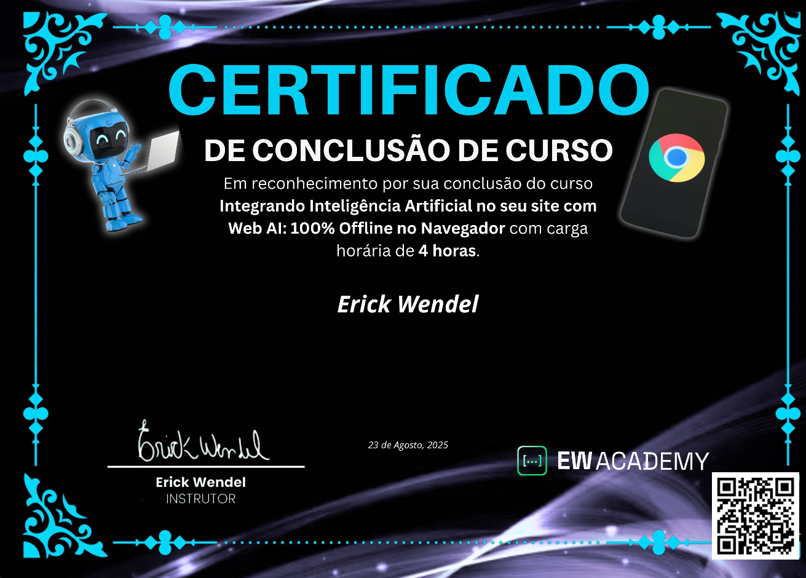

<div align="center">

[](https://now.ew.academy/semana-js-expert-9?utm_source=githubreadme)
[](https://github.com/ErickWendel/semana-javascript-expert09/stargazers)
[](https://github.com/ErickWendel/semana-javascript-expert09/fork)


# Chatbot Inteligente 100% Offline com Prompt API do Chrome

Construindo um widget de chatbot embarcado que roda totalmente no navegador, explorando os recursos experimentais de AI locais da Chrome Prompt API.

⭐ Deixe uma estrela • [Entre para a comunidade](https://discord.gg/2vvUTUb) • [Reporte um problema](../../issues)

</div>

## 🎥 Preview


---

## 📢 Semana JS Expert 09

Este repositório faz parte da **Semana JS Expert 09**, evento gratuito ministrado entre **25/08/2025 e 31/08/2025**.

As aulas completas estão disponíveis em:

👉 [Semana JS Expert 09 na EW Academy](https://now.ew.academy/semana-js-expert-9?utm_source=githubreadme)

> Aproveite enquanto o acesso gratuito estiver liberado! Compartilhe o link com quem quer dominar JavaScript moderno.

### Certificado

Caso você conclua todas as aulas e desafios, receberá este certificado de conclusão (bonitão):



---

### Live demo

- Teste a primeira aula: https://erickwendel.github.io/semana-javascript-expert09/aula01-criando-llmstxt
- Teste a segunda aula: https://erickwendel.github.io/semana-javascript-expert09/aula02-integrando-ai
- Teste a segunda aula: https://erickwendel.github.io/semana-javascript-expert09/aula03-recebendo-como-stream
- Teste a segunda aula: https://erickwendel.github.io/semana-javascript-expert09/aula04-abortando-requisicoes

---

## 📚 Sumário

- [Semana JS Expert 09](#-semana-js-expert-09)
- [Preview](#-preview)
- [Objetivo](#-objetivo)
- [Recursos Principais](#-recursos-principais)
- [Arquitetura e Estrutura](#-arquitetura-e-estrutura)
- [Pré-requisitos](#-pré-requisitos)
- [Instalação Rápida](#-instalação-rápida)
- [Executando](#-executando)
- [Embutindo o Widget em Outro Site](#-embutindo-o-widget-em-outro-site)
- [Customização](#-customização)
- [Limitações e Avisos](#-limitações-e-avisos)
- [Desafios para você](#-desafios)
- [FAQ](#-faq)
- [Contribuição](#-contribuição)
- [EW Academy](#-ew-academy)

---

## 🎯 Objetivo

Aprender, de forma prática, como criar um chatbot que usa **modelos de IA locais / embarcados** via recursos experimentais do Chrome, sem depender de um backend externo. Você terá um widget reutilizável que pode ser plugado em qualquer página.

## 🚀 Recursos Principais

- 100% offline (sem chamadas para servidores – ideal para protótipos e privacidade).
- API moderna do Chrome (Prompt API / AI APIs experimentais).
- Arquitetura simples com separação entre Controller, View e Services.
- Suporte a mensagens streaming simuladas / indicador de digitação.
- Fácil de estilizar via CSS custom properties.
- Preparado para abortar requisições (ex: botão Stop nas aulas avançadas).

## 🧱 Arquitetura e Estrutura do Widget

```

sdk/
    ew-chatbot.html      # Snippet para embutir
    ew-chatbot.css       # Estilos e variáveis CSS
    src/
        index.js           # Bootstrapping
        controllers/chatBotController.js
        views/chatBotView.js
        services/promptService.js (adapta chamadas de IA)
    botData/
        systemPrompt.txt
        chatbot-config.json
        avatar.webp
```

- Cada aula possui evolução incremental (ex: abortar requests, streaming, melhorias UX...).
- A pasta `_template` serve como base para começar novas aulas/features.

## ✅ Pré-requisitos

- Node.js 22+ (para scripts utilitários e servidor estático simples).
- Navegador **Chrome** (versão compatível com as AI / Prompt APIs experimentais).
- Habilitar flags experimentais:
  - [chrome://flags/#prompt-api-for-gemini-nano](chrome://flags/#prompt-api-for-gemini-nano)

## ⚡ Instalação Rápida

Clone o repositório e instale as dependências dentro da pasta da aula desejada.

Exemplo para acessar a primeira aula:

```bash
git clone https://github.com/erickwendel/semana-javascript-expert09

cd semana-javascript-expert09/aula01-criando-llmstxt

npm ci
npm start
```

E então interaja pelo widget no canto da tela.

## 🔌 Embutindo o Widget em Outro Site

Crie a pasta `botData` no projeto em que queira embutir o widget e customize `botData/chatbot-config.json` para alterar nome, avatar e cores.

Você publicar os arquivos da pasta `sdk/` na Web (um cdn talvez) e referenciar o arquivo, algo como:

```html
<!DOCTYPE html>
<html lang="pt-br">
  <head>
    <meta charset="UTF-8" />
    <meta name="viewport" content="width=device-width, initial-scale=1.0" />
    <title>EW Academy AI Chatbot</title>
    <link rel="icon" type="image/x-icon" href="./botData/avatar.webp" />
  </head>

  <body>
    <script
      type="module"
      src="https://erickwendel.github.io/semana-javascript-expert09/aula01-criando-llmstxt/sdk/src/index.js"
    ></script>
  </body>
</html>
```

E então o widget aparecerá automaticamente na inicialização na página.

## 🎨 Customização

Conteúdo inicial / comportamento:

- `systemPrompt.txt`: instruções de sistema para o modelo.
- `chatbot-config.json`: metadados (nome, avatar, cores, welcomeBubble etc).

## 🎨 Desafios

1 - Baixar o modelo mediante à autorização dos usuários

- Pergunte ao usuário se ele deseja baixar o modelo
  - verificar que se caso o modelo não esteja disponível na máquina do cliente, para que no chat, ele clique em um botão, inicie o download e então o notifique que acabou

2 - Tornar disponível em outros navegadores

- Se o cliente não está no Google Chrome, você pode trocar o modelo, usar o Hugging face ou até o modelo do Gemma do google e seguir o mesmo processo, perguntando se ele deseja baixar o modelo e mais

3 - Tornar disponível em computadores incompatíveis / com menos poder de processamento

- Implementar um backend para consumir as APIs gratuitas de AI, os modelos menores do Gemma do Google para responder aos usuários
  - Recomendação é usar o [OpenRouter](https://openrouter.ai/), um agregador de modelos de IA que funcionam na nuvem. Lá lá eles deixam você usar APIs de forma gratuita, com alguns limites mas pelos meus testes funciona muito bem.
  - Dar uma olhada na [documentação](https://openrouter.ai/docs/community/open-ai-sdk) para ver como integrar com o Node.js e garantir que suas chaves não vão ficar expostas no frontend.

## ⚠️ Limitações e Avisos

- As Chrome AI / Prompt APIs ainda são experimentais e podem mudar ou exigir flags.
- Recursos offline dependem do suporte do navegador / hardware local.
- Este projeto é educacional – não destina-se a produção sem revisões de segurança.

## ❓ FAQ

**Funciona em Firefox / Safari?** Atualmente o foco é Chrome (APIs experimentais específicas).

**Preciso de servidor backend?** Não para o núcleo demonstrado; tudo roda no cliente.

**Como altero o prompt inicial?** Edite `botData/systemPrompt.txt`.

## 🤝 Contribuição

Contribuições são bem-vindas! Sugestões, issues e PRs ajudam a evoluir o material.

1. Faça um fork
2. Crie uma branch: `git checkout -b feat/minha-feature`
3. Commit: `git commit -m "feat: minha feature"`
4. Push: `git push origin feat/minha-feature`
5. Abra um Pull Request

Se este projeto te ajudou, deixe uma ⭐. Isso incentiva novos conteúdos gratuitos.

## 🏫 EW Academy

<div align="center">
    
    <p><strong>Plataforma oficial do Erick Wendel</strong> com cursos, eventos e conteúdos exclusivos sobre JavaScript, Node.js e tecnologia moderna.</p>
    <a href="https://ew.academy" target="_blank"><b>Inscreva-se agora em ew.academy</b></a>
</div>

---

Feito com 💜 durante a Semana JS Expert 09.
